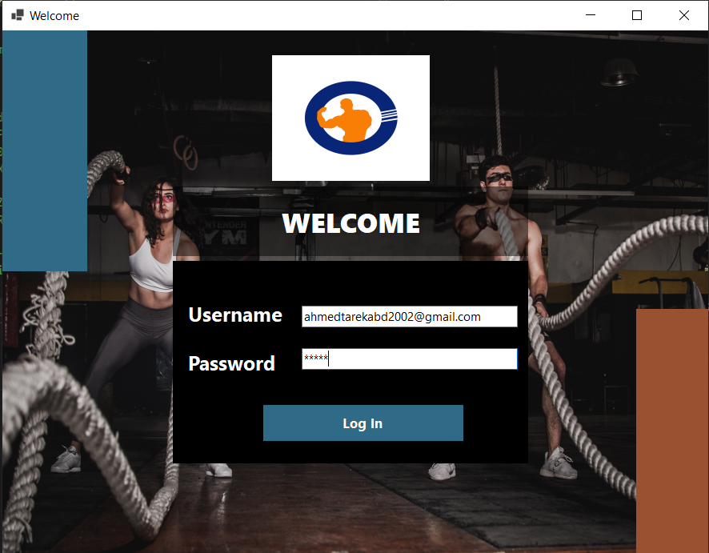
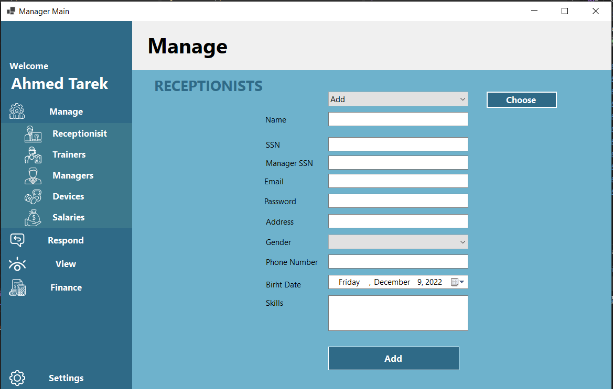
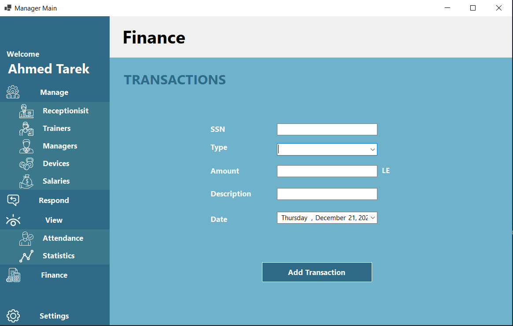
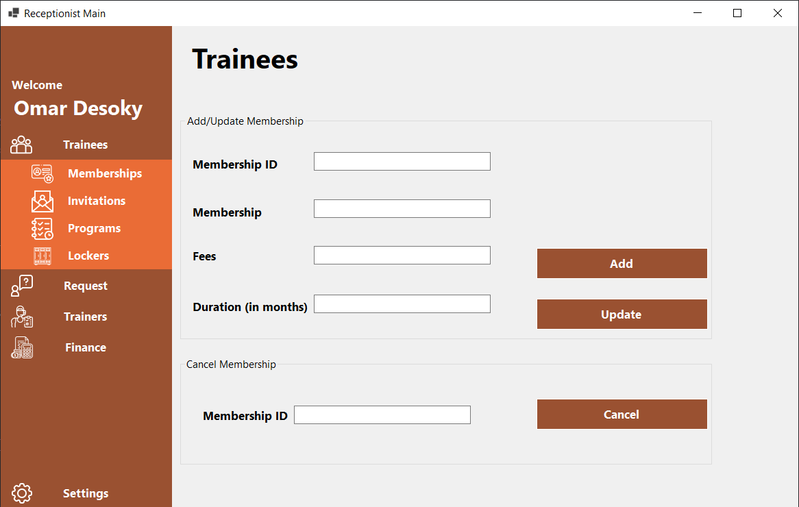

# Gym Management Desktop Application

## Users

1. Managers(owners)
2. Receptionists

## Walkthrough

### Login

Users can login and will be redirected to the right form according to their role.

#### Manager

##### Manage Options

Options such as Adding, Delete, Remove, Searching for each of the following

1. Receptionists
2. Trainers
3. Other Managers
4. Devices
5. Salaries
   

##### Respond to Requests

Managers can responds to receptionists holiday's requests

##### View Attendance

Managers can view the attendance of the Employees including receptionists, Trainers and Trainees.

##### Log Transactions

Managers can register transactions such as:

1. Memberships
2. Specify type
   1. Withdraw
   2. Deposit
3. Descriptions

#### Receptionists

Have common functionalities but different data access.

Functionalities such as

1. Adding, Delete, Remove, Searching Trainees
2. Manage Trainees
   1. Memberships
   2. Programs
   3. Invitiations
   4. Lockers
3. Check Trainers' (PT) attendance
4. Assign Trainees with their Trainer

